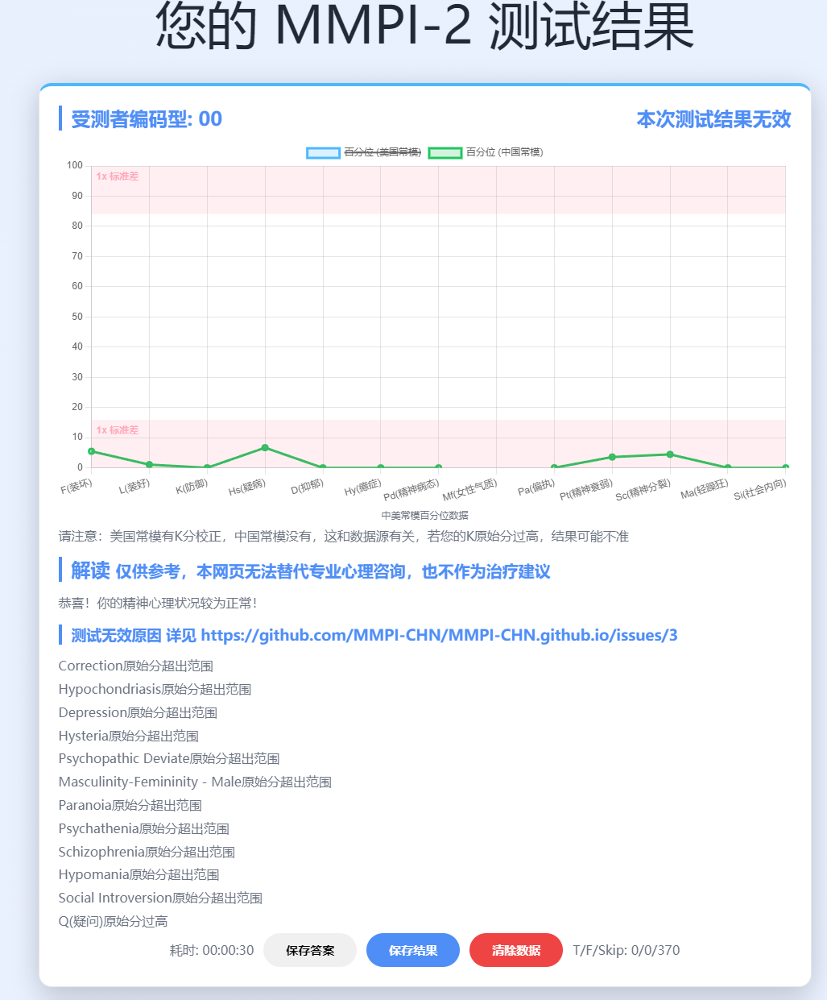
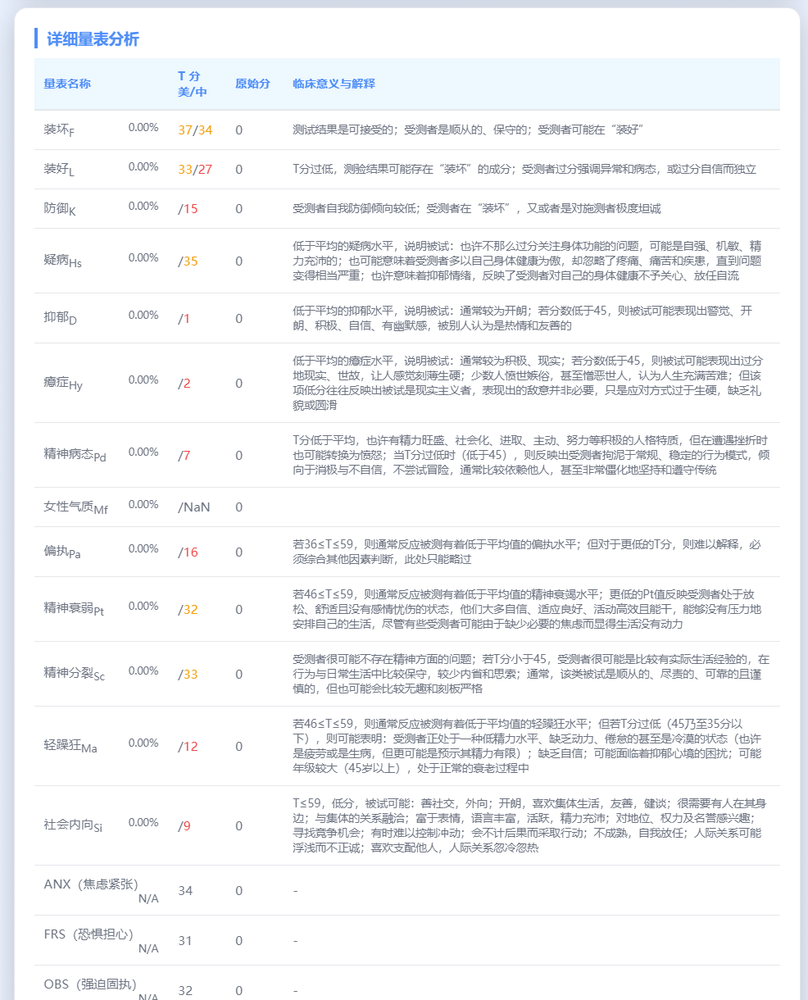

# MMPI2中美常模全新界面版本

- 首先带有记忆功能，刷新页面不会丢失数据
- 其次支持JSON和TXT导入/导出
- 然后还有中美常模对比分析
- 响应式界面，支持移动端
- 显示超多量表

## 如何使用
- 在Release里下载`MMPI2双模单文件版.html`然后双击打开
- 所有数据存在浏览器`localStorage`中

## 图片

## 鸣谢：数据来源（没有它们就没有这个项目）
- https://github.com/LLAA178/mmpi2-CN-normals
- https://github.com/MMPI-CHN/MMPI-CHN.github.io